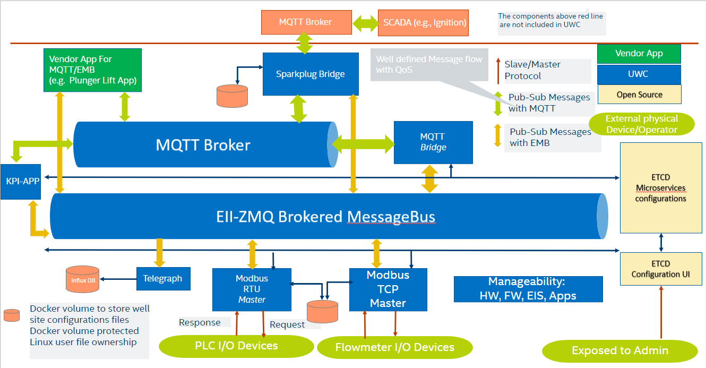

========================
3.0  Before Installation
========================

This section explains various concepts used throughout this document.

------------------------------------------------------
3.1  Universal Wellpad Controller for Oil and Gas Site
------------------------------------------------------

The Universal Wellpad Controller is a reference design that provides a secure management platform for oil and gas upstream process monitoring and control to support oil and gas installations with various artificial lift methods such as plunger lift, gas lift, and so on. Universal Wellpad Controller is a profile on the Edge Insights for Industrial (EII) base platform. 
Universal Wellpad Controller provides the following:
    • Soft-real time deterministic control (millisecond level control) in the containerized environment 
    • Configurable user-defined data model describing oil well site
    • Modularized microservices-based extensible open architecture
    • Well defined message flow and payload to interact with the vendor application
    • Policy-based execution of Soft-RT applications
    • Supports multiple well pads and devices configurations
    • Polls and controls multiple devices simultaneously
    • Data Publish Subscribe ZeroMQ and MQTT (Message Queuing Telemetry Transport)
    • Device Management – System Telemetry, over-the-network also known as over-the-air (OTA), Firmware Update Over the Air (FOTA), Software Over the Air (SOTA), and Application Over the Air (AOTA)
    • Scalable-down to power-sensitive remote applications
    • Scalable-up to edge analytics and vision through the EII base

------------------------------------
3.2  Upstream Oil and Gas Facilities
------------------------------------

.. figure:: Doc_Images/image1.png
    :scale: 60 %
    :align: center

The example provided for Universal Wellpad Controller in this Guide is for a natural gas wellhead with one or more wells. The wellhead will have several field devices often using the Modbus protocols (both TCP and RTU). A Modbus device will have several points to be read and/or written. The table below shows how wellhead, devices, and points are related to each other.

.. list-table:: 
   :widths: 25 25 25
   :header-rows: 1

   * - Wellhead
     - Device
     - Point
   * - Wellhead1
     - flowmeter1
     - keepAlive
   * - Wellhead1
     - flowmeter1 
     - flow
   * - Wellhead1 
     - iou
     - AValve   
   * - Wellhead2
     - flowmeter2
     - KeepAlive
   * - Wellhead3
     - iou
     - BValve

There could be similar devices and similar points in different wellheads. Hence, Universal Wellpad Controller uses this hierarchy to uniquely name a point. A point is identified like “/device/wellhead/point” for example, flowmeter1/Wellhead1/KeepAlive 
Universal Wellpad Controller defines a data model which can be used to describe the hierarchy of wellhead, device and points.

.. figure:: Doc_Images/image2.png
    :scale: 15 %
    :align: center

    Figure 3.2.  Site configurations

--------------------------------------------------------
3.3  Understanding Universal Wellpad Controller Platform
--------------------------------------------------------

    Figure 3.3.  High-level block diagram of Universal Wellpad Controller

The application can subscribe to MQTT topics to receive polled data. Similarly, the application can publish data to be written on MQTT. The platform will accordingly publish or subscribe to respective topics. The MQTT topics to be used can be configured. 
Internally, Universal Wellpad Controller platform uses a message bus (called ZMQ) for which the topics need to be configured. ZMQ is not shown above for ease of understanding.

3.3.1  Modbus containers
~~~~~~~~~~~~~~~~~~~~~~~~

Universal Wellpad Controller supports Modbus TCP master and Modbus RTU master for communicating with Modbus slave devices present in a field. These are developed as two separate containers i.e., Modbus TCP container and Modbus RTU container. Please refer to the diagram in section 2.3.

**1.  Modbus RTU master container**

Modbus RTU devices can be connected using RS485 or RS232. Normally, with RS232, only one device is connected at one time. Hence, to communicate with two Modbus RTU devices over RS232, two different serial ports will be needed.

Modbus RTU protocol with RS485 physical transport uses a twisted pair of wires in a daisy-chain shared media for all devices on a chain. The communications parameters of all devices on a chain should be the same. If different devices have different configurations for example, different parity, different baud rate, and so on, then, different Modbus RTU chains can be formed. To communicate with two different Modbus RTU networks, two different serial ports will be needed. It is important to verify the analog signal integrity of the RS-485 chains including the use of termination resistors as per well-known RS-485 best practices.
In Universal Wellpad Controller, one Modbus RTU master can be configured to communicate over multiple serial ports. Hence a single Modbus RTU master container handles communication with multiple Modbus RTU networks. The configuration for one Modbus RTU network for example, port, baud rate, and so on can be configured in an RTU network configuration file. The information about this is available in a later section of this document.

3.3.2	MQTT-Bridge container
~~~~~~~~~~~~~~~~~~~~~~~~~~~~~

Modbus containers communicate over ZMQ. The MQTT-Bridge module enables communication with Modbus containers using MQTT. The MQTT- Bridge module reads data on ZMQ received from Modbus containers and publishes that data on MQTT. Similarly, the MQTT- Bridge module reads data from MQTT and publishes it on ZMQ.
This module was earlier known as MQTT-Export.

3.3.3  Sparkplug-Bridge container
~~~~~~~~~~~~~~~~~~~~~~~~~~~~~~~~~

Universal Wellpad Controller supports Eclipse Foundation’s SparkPlug* standard to expose data to Supervisory Control And Data Acquisition (SCADA) Master over MQTT. Sparkplug-Bridge implements the standard and enables communication with SCADA Master. This module was earlier known as SCADA-RTU. 
This module exposes the data on the platform to an external, centralized, Master system for the SCADA: 
    • Data from base Universal Wellpad Controller platform i.e., real devices
    • Mechanism to expose data from Apps running on Universal Wellpad Controller i.e., virtual devices

**1.  SparkPlug MQTT Topic Namespace**

The following is the topic format
    *spBv1.0/group_id/message_type/edge_node_id/[device_id]*

Is TLS required for sparkplug-bridge (yes/no): 
    no
Enter the external broker address/hostname:
    192.164.1.2
Enter the external broker port number: 
    11883
Enter the QOS for scada (between 0 to 2): 
    2

The group_id element of the Sparkplug* Topic Namespace provides for a logical grouping of MQTT EoN nodes into the MQTT Server and back out to the consuming MQTT Clients. The value should be descriptive but as small as possible.

The value of the group_id can be valid UTF-8 alphanumeric string. The string shall not use the reserved characters of ‘+’ (plus), ‘/’ (forward slash), and ‘#’ (number sign).

The value of this field can be configured in a configuration file, :ref:`link <link>`

**message_type:**

The message_type elements are defined for the Sparkplug* Topic Namespace. The values could be: 

    •	NBIRTH – Birth certificate for MQTT EoN nodes.
    •	NDEATH – Death certificate for MQTT EoN nodes.
    •	DBIRTH – Birth certificate for Devices.
    •	DDEATH – Death certificate for Devices.
    •	NDATA – Node data message.
    •	DDATA – Device data message.
    •	NCMD – Node command message.
    •	DCMD – Device command message.
    •	STATE – Critical application state message.

**edge_node_id:**

The edge_node_id element of the Sparkplug* Topic Namespace uniquely identifies the MQTT EoN node within the infrastructure. The group_id combined with the edge_node_id element must be unique from any other group_id/edge_node_id assigned in the MQTT infrastructure. The topic element edge_node_id travels with every message published and should be as short as possible.

The value of the edge_node_id can be valid UTF-8 alphanumeric string. The string shall not use the reserved characters of ‘+’ (plus), ‘/’ (forward slash), and ‘#’ (number sign).

The value of this field can be configured in a configuration file, :ref:`link <link>`

**device_id:**

The device_id element of the Sparkplug* Topic Namespace identifies a device attached (physically or logically) to the MQTT EoN node. The device_id must be unique from other devices connected to the same EoN node. The device_id element travels with every message published and should be as short as possible.

The format of the device_id is a valid UTF-8 alphanumeric String. The string shall not use the reserved characters of ‘+’ (plus), ‘/’ (forward slash), and ‘#’ (number sign).

**2. 	Supported message types**

The following message types are supported in the current version of Universal Wellpad Controller:

.. list-table:: 
   :widths: 25 25 25
   :header-rows: 1

   * - Message Type
     - Support for real devices
     - Support for virtual devices (Apps)
   * - NBIRTH
     - Supported. This is an edge level message.
     - Supported. This is an edge level message.
   * - NDEATH
     - Supported. This is an edge level message.
     - Supported. This is an edge level message.
   * - DBIRTH 
     - Supported. 
       Data is taken from YML file.
     - Supported. Vendor app should publish data on “BIRTH” topic.   
   * - DDATA
     - Supported. Data from Poll-update messages is 
       taken to determine change in data
       for publishing a DDATA message
     - Supported using RBE (Report by Exception). 
       Vendor app should publish data on “DATA” topic.
   * - DCMD
     - Supported. A corresponding On-Demand-Write request message is
       published on internal MQTT for other Universal Wellpad Controller containers to process a request
     - Supported. A corresponding CMD message is
       published on internal MQTT for vendor app.
   * - DDEATH
     - Supported. Data from Poll-update messages is taken to determine change 
       in data for publishing a DDEATH message in case of error scenarios
     - Supported. Vendor app should publish data on “DEATH” topic.
   * - NDATA
     - Not Supported
     - Not Supported
   * - NCMD
     - Supported “Node Control/Rebirth” control
     - Supported “Node Control/Rebirth” control
   * - STATE
     - Not Supported
     - Not Supported

**3.	Name of edge node**

User should properly configure “group_id” and “edge_node_id” for each edge gateway deployed in a site such that each edge node can be uniquely identified.

3.3.4  KPI Application Container
~~~~~~~~~~~~~~~~~~~~~~~~~~~~~~~~

One sample application called “KPI Application” is provided to depict how one can develop an application on the Universal Wellpad Controller platform. This is a simple application that demonstrates how a “single input, single output” control loop can be implemented.

A control loop is executed continuously to monitor certain parameter and adjust other parameters. Thus, a control loop consists of one read operation and one write operation. In this sample application, polling mechanism of the Universal Wellpad Controller platform is used to receive values of parameters as per polling interval. The application uses “on-demand-write” operation on receiving data from polling.

This KPI Application can either be executed based on MQTT communication or based on ZMQ communication. Refer to the configurations for more details.

The KPI Application also logs all data received as a part of the control loop application in a log file. This data can be used for measuring the performance of the system.

3.3.5  Configurations
~~~~~~~~~~~~~~~~~~~~~

Universal Wellpad Controller needs the following configuration to function properly:
    •	Information about device group list which is wellhead, device, and points falling under respective Modbus container
    •	Information about topics for internal message queue, publishers, and subscribers

All these configurations are related and depend on the hierarchy of wellhead, device, and point.
The following sections detail the Universal Wellpad Controller installation and configuration process.
