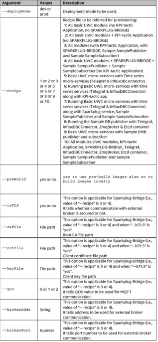

=======================
4.0  Installation Guide
=======================

-------------------------------------------------------------------
4.1  How to install Universal Wellpad Controller with EII installer
-------------------------------------------------------------------

This section provides steps to install and deploy Universal Wellpad Controller containers using the EII installer.

**Prerequisite**: As a prerequisite to install the Universal Wellpad Controller, you need an internet connection with correct proxy settings.

**Optional**: For enabling full security for production deployments, ensure to configure host machine and docker daemon with the following security recommendations.       ../build/docker_security_recommendation.md

**Steps:**

1. Install Ubuntu 20.04 server version on gateway and then, apply the RT Patch. For more information, see section 14.
2. Run repo commands in the following order which will place the directories in the correct relative directory structure

.. code-block:: sh

    •	repo init -u https://github.com/open-edge-insights/eii-manifests.git -b refs/tags/v2.0
    •	repo init -m uwc.xml
    •	repo sync

3. Navigate to the build folder from the following path <working_dir>/IEdgeInsights/build
4. Based on the proxy settings, run any of the following commands:
   
   * For a proxy enabled network, run ./pre_requisites.sh --proxy=<proxy address with port number>
   * For a non-proxy network, run sudo ./pre_requisites.sh 

.. note::
       
    Rerun the pre_requisite.sh script, if the "Docker CE installation step is failed" error occurs while running the pre-requisite.sh script on a fresh system. This is a known bug in the docker community for Docker CE.

5. Navigate to ``<working_dir>/IEdgeInsights/uwc/build_scripts``.   
6. Run the following command:

.. code-block:: sh
 
 sudo -E ./01_uwc_pre_requisites.sh
    
7. Run the following command:

.. code-block:: sh

 sudo -E ./02_provision_build_UWC.sh

8. Select one of the following options based on Dev mode or Prod mode.
   - Dev
   - Prod 
9. Based on the use case (combination of Universal Wellpad Controller services), select one of the following options: 

   1. Basic UWC micro-services without KPI-tactic Application & Sparkplug-Bridge - (Modbus-master TCP & RTU, mqtt-bridge, internal mqtt broker, ETCD server, ETCD UI &        other base EII & UWC services)
   2. Basic UWC micro-services as in option 1 along with KPI-tactic Application (Without Sparkplug-Bridge)
   3. Basic UWC micro-services & KPI-tactic Application along with Sparkplug-Bridge, Sample SamplePublisher and Sample SampleSubscriber
   4. Basic UWC micro-services with Sparkplug-Bridge, Sample SamplePublisher and Sample SampleSubscriber and no KPI-tactic Application
   5. Basic UWC micro-services with Time series micro-services (Telegraf & InfluxDBConnector)
   6. Running Basic UWC micro-services with time series services (Telegraf & InfluxDBCOnnector) along with KPI-tactic app
   7. Running Basic UWC micro-services with time series services (Telegraf & InfluxDBCOnnector) along with Sparkplug service, Sample SamplePublisher and Sample              SampleSubscriber
   8. Running the Sample DB publisher with Telegraf, InfluxDBCOnnector, ZmqBroker & Etcd container
   9. Basic UWC micro-services with Sample SamplePublisher and Sample SampleSubscriber
   10. All modules UWC modules, KPI-tactic Application, SPARKPLUG-BRIDGE, Telegraf, InfluxDBCOnnector, ZmqBroker, Etcd container, SamplePublisher, and           SampleSubscriber
    * Do you want to use pre-build images from public docker hub ?
    - Yes  
    - No

For the Sparkplug-Bridge-related configuration, refer to the following sample output:

**• Enter the following parameters required for Sparkplug-Bridge container..**

Is TLS required for sparkplug-bridge (yes/no): 
    yes
Enter the CA certificate full path including file name (e.g. <Work_Dir>/IEdgeInsights/build/Certificates/rootca/cacert.pem):
    <Work_Dir>/root-ca.pem
Enter the client certificate full path including file name (e.g. <Work_Dir>/IEdgeInsights/build/Certificates/mymqttcerts/mymqttcerts_client_certificate.pem ): 
    <Work_Dir>/client_crt.pem
Enter the client key certificate full path including file name (e.g. <Work_Dir>/IEdgeInsights/build/Certificates/mymqttcerts/mymqttcerts_client_key.pem ):
    <Work_Dir>/client_key.pem
Enter the external broker address/hostname (e.g. 192.168.0.5 or dummyhost.com):
    192.168.1.11
Enter the external broker port number: 
    22883
Enter the QOS for scada (between 0 to 2): 
    1

**•	Enter the following parameters required for sparkplug-bridge container**

Is TLS required for sparkplug-bridge (yes/no): 
    no
Enter the external broker address/hostname (e.g. 192.168.0.5 or dummyhost.com):
    192.168.1.11
Enter the external broker port number: 
    22883
Enter the QOS for scada (between 0 to 2): 
    1

10.	Run the following command:

.. code-block:: sh

sudo -E ./03_Run_UWC.sh

.. note::

    These steps are the process for interactive mode. For a non-interactive mode support, refer to the following steps

11. To support non-interactive mode, the following options are added in the 2nd script (02_provision_build_UWC.sh).

If the required parameters are not available, then in the interactive mode, you need to provide the details for the required parameters.
12.	Following are sample commands for the non-interactive mode execution.

    * For all the Universal Wellpad Controller basic modules (no KPI, no Sparkplug-Bridge), run the following command:

.. code-block:: sh    
    
      sudo -E ./02_provision_build_UWC.sh --deployMode=dev --recipe=1

    * For all the Universal Wellpad Controller modules (with KPI and with Sparkplug-Bridge).
    
.. code-block:: sh 
 
      sudo -E ./02_provision_build_UWC.sh --deployMode=dev --recipe=3 --isTLS=yes --caFile="scada_ext_certs/ca/root-ca.crt" --crtFile="scada_ext_certs/client/client.crt" --keyFile="scada_ext_certs/client/client.key" --brokerAddr="192.168.1.11" --brokerPort=22883 --qos=1

Build scripts descriptions

    1. 01_uwc_pre_requisites.sh - This script creates docker volume directory /opt/intel/eii/uwc_data, creates “/opt/intel/eii/container_logs/” for storing log, and git clone modconn into respective directory of the Modbus master container.  
    
    2. 02_provision_build_UWC.sh - This script runs the builder to generate the consolidated docker-compose.yml. This script performs provisioning per the docker-compose.yml file. Along with this, it generates certs for the MQTT and builds all the microservices of the docker-compose.yml.
        It allows you to choose combination of Universal Wellpad Controller services, deployment mode either dev or prod mode, or select whether to use the `pre-build images` or `build images locally`.

    3. 03_Run_UWC.sh - This script deploys all Universal Wellpad Controller containers.

    4. 04_uninstall_UWC.sh – Used for cleanup and uninstalling docker, docker-compose, and installed libraries. This script will bring down all containers and remove all running containers.

    5. 05_applyConfigChanges.sh - This script will stop and start all running containers with updated changes.

    6. 06_UnitTestRun.sh - This script will generate unit test report and code coverage report.

.. note::

Rerun the "./02_provision_build_UWC.sh" script to change the use case that is running. This will remove or kill all the containers of the existing use case and recreate the consolidated docker-compose.yml and consolidated eii_config.json file per the new use case selected in the "./02_provision_build_UWC.sh" script. Provisioning and build is also done as part of this script. Run the "03_Run_UWC.sh" script after running the "02_provision_build_UWC.sh" script. This will bring up all the containers of the new use case.
